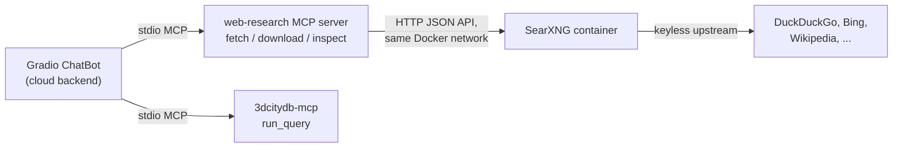

# Idea: Web Search & Document Inspection for the ChatBot

## Goal

Extend the ChatBot so that, beyond querying the 3DCityDB database via `run_query`,
it can:

1. **Search the web** for information not present in the database
   (e.g. "What does the CityGML 3.0 spec say about `roofType` codes?").
2. **Download files** (documentations, specifications, data dictionaries)
   into a local, inspectable store.
3. **Inspect the downloaded files** in chunks, so the model can answer
   questions grounded in the actual document content.

Typical user request: *"Download the CityGML 3.0 encoding specification and
tell me which roof types are defined."*

## Required Capabilities (three distinct tools)

| Tool | Purpose |
|------|---------|
| `web_search(query)` | Ranked list of URLs + snippets for a query |
| `fetch_url(url)` | Pull a web page, convert HTML → clean markdown/text (size-capped) |
| `download_file(url)` + `inspect_file(path, offset, limit)` | Save a document (PDF, zip, …) to disk; extract text slice-by-slice for the model to read |

Key design point: **no off-the-shelf component does "download a binary and let
an LLM read it in chunks"** — the official `mcp-server-fetch` returns page *content*
and cannot handle binaries, and filesystem MCP servers can only read files that
already exist on a shared volume. The download + chunked-inspect part must be
custom-built in any variant below.

## Option A: Commercial search APIs (Tavily / Brave)

- **Tavily** (tavily.com) — search API designed for LLMs; clean snippets, dedup.
  Sign-up + API key; paid beyond a free tier.
- **Brave Search** (api.search.brave.app) — Brave's search API; also key +
  free credits, then paid.

**Verdict: rejected.** Both require the *user* to create an API key with an
external company, send queries to third-party servers, and incur per-query
costs. This conflicts with the self-hosted, no-external-dependency philosophy
of this project (local Ollama support, self-hosted Postgres, BYOD variant).

## Option B: SearXNG (recommended for the search step)

[SearXNG](https://github.com/searxng/searxng) is a self-hosted, open-source
metasearch engine. No API keys at all — it aggregates keyless upstream engines
(DuckDuckGo, Bing, Wikipedia, …). It exposes a local **JSON API**, and an
off-the-shelf MCP wrapper (`searxng-mcp`, Python, stdio) exists.

Architecture:



Docker-side additions (`docker-compose.*.yml`):

```yaml
services:
  searxng:
    image: searxng/searxng:latest
    volumes:
      - ./searxng/settings.yml:/etc/searxng/settings.yml:ro
    # no host ports needed if only the agent container consumes the API
```

with `settings.yml`:

```yaml
search:
  formats:
    - html
    - json        # critical — the JSON API is disabled by default
```

`.env` additions:

```dotenv
SEARXNG_BASE_URL=http://searxng:8888   # internal Docker network address
```

**Trade-offs of SearXNG:**

- ✅ No external dependency, no per-query cost, fully self-hosted.
- ⚠️ Upstream engines can throttle/block datacenter IPs intermittently
  (notably Google). Mitigation: enable a broad set of engines in
  `settings.yml` so no single engine being blocked breaks search.
- ⚠️ Result quality is raw (no LLM-tuned snippets) — post-process on the
  client side (e.g. truncate snippets to ~500 chars) to keep context small.
- 📝 Privacy: the bot itself is fully self-hosted, but upstream engines still
  see their share of the queries. Weight private engines
  (DuckDuckGo, Qwant, Startpage) higher if this matters.
- 💡 For the actual use case (document/spec lookup), direct URL fetching and
  Wikipedia-style reference lookups are often more reliable than any search
  ranking anyway — SearXNG is the discovery step, not the whole pipeline.

## Option C: Off-the-shelf MCP servers only

Combine `searxng-mcp` + official `mcp-server-fetch` + `mcp-server-filesystem`.

**Rejected.** Fragmented: three servers for one workflow, filesystem server
needs volume sharing with the WebUI container, and none of them provides the
download-binary → chunked-text-extraction glue. A single small custom server
is less total code and far less wiring.

## Recommended Design: One Small Custom MCP Server ("web-research")

Build one tiny MCP server exposing 3–4 tools; fold the SearXNG call in or keep
`searxng-mcp` as a separate server for search:

```python
# tools
web_search(query)                           → [{title, url, snippet}, ...]   (SearXNG JSON API)
fetch_url(url)                              → markdown text (trafilatura/bs4), size-capped
download_file(url, filename?)               → saves to /app/webui/downloads/, returns {path, size, mime}
inspect_file(path, offset=0, limit=4000)    → text slice (pypdf for PDFs, unzip for .zip, raw for .txt/.md/.csv)
```

Reasons for an MCP server rather than plain Python functions in `webui/`:

- **Reusable** — immediately available to `server_sse.py` clients, MCP
  Inspector, VS Code, and any other agent, not just the Gradio bot.
- Keeps PDF-parsing dependencies (`pypdf`, `trafilatura`, …) out of the
  WebUI's dependency tree.

Counter-argument (honest alternative): if this is *only* ever needed by the
ChatBot, plain functions in `webui/` wired into the cloud backend's tool
dispatch are ~200 lines and skip subprocess/session management. Both are
reasonable; the MCP route is more future-proof for this codebase.

## Integration Touchpoints (WebUI-side)

The WebUI currently assumes a single tool (`run_query`). For web research to
work, these need to become tool-agnostic (details in
[idea-for-future-multiple-MCP-servers.md](idea-for-future-multiple-MCP-servers.md)):

- `production/webui/mcp_client.py` — spawn/connect additional server(s),
  route tool calls by name.
- `production/webui/backends/cloud.py` — replace the hard-coded
  `tools=[RUN_QUERY_TOOL]` with a merged tool list; dispatch by tool name
  instead of assuming `args["sql"]`.
- `production/webui/app.py` — the `tool_executor=lambda sql: …` becomes a
  generic dispatcher; `_render_tool_call` should show tool name + JSON args
  instead of a forced ```sql fence.
- **System prompt** — append a short "Web research" section (the CityGML
  part stays from `assemble_prompt`): when to search vs. query the DB, how to
  page through documents via `inspect_file`, and to never present unverified
  web content as database facts.
- **Tool-result cache** — `_build_tool_cache` is SQL-specific; for web tools
  either skip caching or store a URL/summary instead.
- **`.env`** — server toggles/commands + `WEB_DOWNLOAD_DIR` pointing at a
  bind mount (like the `/tiles` volume pattern in `importer.py`) so downloads
  survive container restarts.

## Critical Design Concern: Result-Size Discipline

This is the single biggest risk. The chat loop has a token budget
(`_trim_messages`, `MAX_CONTEXT_CHARS` in `app.py`, `_truncate_result` in
`llm_utils.py`). A 300-page specification will blow the context window
instantly if returned whole. Therefore:

- `inspect_file` **must** return bounded slices (e.g. 3–4k chars) with
  `offset`/`limit` parameters, and the model pages through the document.
  This chunking design matters more than any other detail — it determines
  whether "download this spec and tell me how X is defined" works at all.
- `fetch_url` results size-capped (e.g. 30k chars) before entering context.
- Search snippets truncated in the tool layer (not by the model).

## Security Considerations

The model decides which URLs get fetched:

- Enforce **HTTPS + size caps** (e.g. 50 MB max download).
- **Sandbox downloads** to one directory only; never execute downloaded
  content.
- **SSRF protection**: block private/resolved-internal IP ranges (a steered
  model could otherwise reach `http://169.254.169.254` or the internal
  Postgres host).
- Keep fetches **uncached** by default (stale content is worse than a refetch).

## Known Limitation

The local (Ollama) backend's ReAct parser in `production/webui/backends/local.py`
is hard-wired to `run_query` — so web tools initially work **only with
Anthropic/OpenAI models** until that parser is generalized.

## Estimated Effort

| Piece | Effort |
|-------|--------|
| SearXNG container + `settings.yml` | ~1 hour |
| `web-research` MCP server (4 tools, ~150–250 lines) | half a day |
| WebUI integration (tool-agnostic dispatch in `cloud.py` / `app.py` / `mcp_client.py`) | ~1 day (overlaps with the multi-MCP-server work) |
| System-prompt section + UI rendering for non-SQL tool calls | a few hours |

**Total: roughly 2–3 working days**, with the multi-server plumbing shared
with [idea-for-future-multiple-MCP-servers.md](idea-for-future-multiple-MCP-servers.md).

## Suggested Build Order

1. Get `inspect_file` chunking right (it dictates the workflow).
2. SearXNG container + `web_search`.
3. `fetch_url` (trafilatura).
4. `download_file` + security guards (SSRF, size caps).
5. WebUI integration + prompt section + UI rendering.
